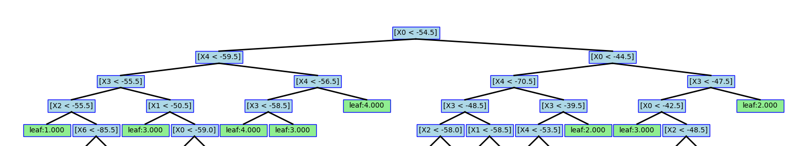

# intro-to-ml-cw1

## Name
Intro to Machine Learning Coursework 1

## Description
This is a decision tree algorithm and it is used to determine one of the indoor locations based on WIFI signal strengths collected from a mobile phone. 
The algorithm has the following structure:
```
Project folder/
├─ decision_tree/
│  ├─ decision_tree.py
|  ├─ evaluation.py
|  ├─ pruning.py
├─ wifi_db/
│  ├─ clean_dataset.txt
│  ├─ noisy_dataset.txt
├─ requirements.txt
├─ README.md
├─ image.png
```
The decision_tree.py is used to construct a decision tree and visualisation of the tree; evaluation.py is used to evaluate performances of the tree; pruning.py is to prune the tree to improve performances.

### `decision_tree/`

- `decision_tree.py` contains the `Decision_tree` class. It contains the methods to build, visualise and to use the tree for training and predicting

- `evaluation.py` contains the methods need for evaluation. By calculating F1 score, precision, accuracy and recall. Cross validation is implemented here to evaluate the decision_tree.

- `pruning.py` contains the evaluation of pruning by comparing the tree before pruning and after pruning. The comparision is done by focusing on the confuse matrix and other attributes.

 


### `wifi_db/`

Contains the wifi data files.

- `clean_dataset.txt`
- `noisy_dataset.txt`

## Visuals


## Installation
### On a DoC lab machine:
Activate virtual environment:
```bash
    $ source /vol/lab/ml/intro2ml/bin/activate
```

install requirenments
```bash
    (intro2ml) $ python3-c "import numpy as np; import torch; print(np); print(torch)"
```

### On personal machine:
Activate/Create virtual environment and name it venv or .venv
```bash
    python -m venv .venv
```
On Mac or Linux:
```bash
    source venv/bin/activate
```
On Windows:
```bash
    venv/scripts/activate
```
Install requirements
```bash
    pip install --upgrade pip
    pip install -r requirements.txt
```

### Run
To run individual task
Task 2 Decision Trees
```bash
    python -m decision_tree.decision_tree
```
Task 3 Evaluation
```bash
    python -m decision_tree.evaluation
```
Task 4 Pruning
```bash
    python -m decision_tree.pruning     
```

## Support
For more information, email Zhiming Hong (zhiming.hong24@imperial.ac.uk)

## Authors and acknowledgment (In alphabetic order)
Haoyi Zhang<br>
Huazhen Xu<br>
Tongjia Li<br>
Zhiming Hong<br>

## Project status
The project is complete
